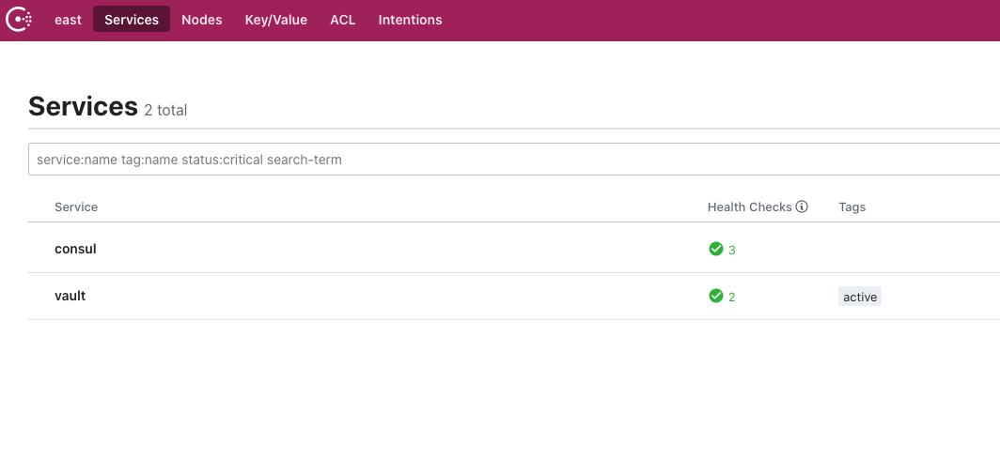
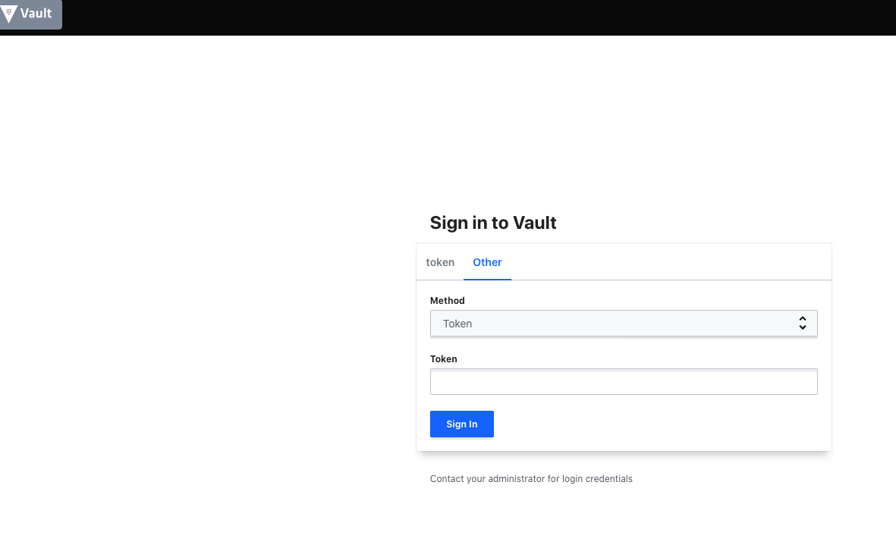

# vault-consul-vagrant
Example of Vault with Consul cluster as backend on Vagrant

# Requirements
- [Vagrant](https://www.vagrantup.com/)
- [Consul](https://www.consul.io/)
- [Vault](https://www.vaultproject.io/)

# How to consume

```bash
git clone git@github.com:andrewpopa/vault-consul-vagrant.git
cd vault-consul-vagrant
```

Subnet which is used in `Vagrantfile` is `192.168.178.0` - adjust this to your subnet

```bash
vagrant up
```

as result of you should have 4 VMs running

```bash
$ vagrant status
Current machine states:

consul1                   running (virtualbox)
consul2                   running (virtualbox)
consul3                   running (virtualbox)
vault                     running (virtualbox)
```

consul nodes will join into cluster and vault will use it as backend.

## Login to Vault

`Do NOT do this in production - unseal key and root token will be stored in` - `/vagrant/init.txt` 

```bash
vagrant ssh vault
cat /vagrant/init.txt
```

use root token to login to Vault

## Consul & Vault

as result you'll have Consul available



Vault server unsealed where you can login with root token generated in `init.txt`

